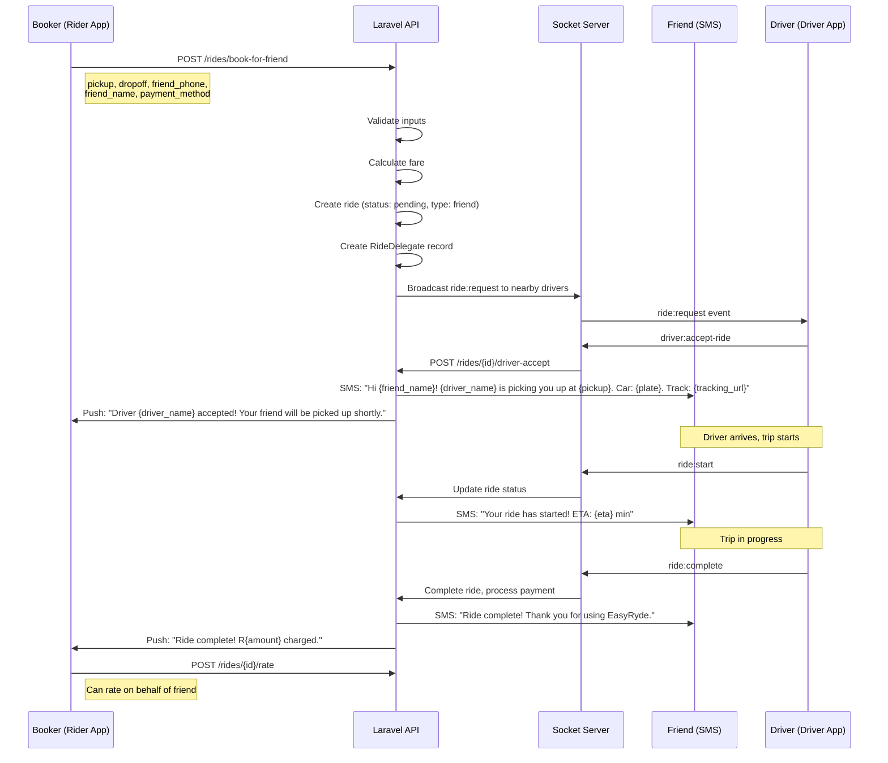

# Booking for a Friend Flow — EasyRyde

**Version:** 1.0.0
**Date:** 2026-07-02
**Status:** New feature specification

---

## 1. Overview

Allow a user to book a ride for someone else. The booker pays, the friend rides. Essential for Phalaborwa market where many people don't have smartphones.

---

## 2. Actors

| Actor | Role | App |
|-------|------|-----|
| Booker | Person booking and paying | Rider App |
| Friend | Person receiving the ride | SMS (no app required) |
| Driver | Person providing the ride | Driver App |
| Admin | Monitor and support | Admin App |

---

## 3. User Story

> As a user, I want to book a ride for my friend/family member who doesn't have the app, so they can get around Phalaborwa without needing a smartphone.

---

## 4. End-to-End Flow



---

## 5. Detailed Steps

### 5.1 Booker Initiates

```
Booker opens BookRideScreen
    │
    ├──▶ Toggle "Book for Someone Else"
    │    → New fields appear:
    │    ├── Friend's Name: [________]
    │    ├── Friend's Phone: [+27 ___ __ __ __]
    │    └── Note to Driver: [________] (optional)
    │
    ├──▶ Select pickup location
    │
    ├──▶ Select dropoff location
    │
    ├──▶ Select vehicle category
    │
    ├──▶ Select payment method (booker pays)
    │
    └──▶ Tap "Book for Friend"
```

### 5.2 API Request

```json
POST /rides/book-for-friend
Authorization: Bearer {booker_token}

{
  "pickup_latitude": -23.9045,
  "pickup_longitude": 29.4688,
  "pickup_address": "123 Main St, Phalaborwa",
  "dropoff_latitude": -23.8900,
  "dropoff_longitude": 29.4500,
  "dropoff_address": "456 Oak Ave, Phalaborwa",
  "category": "economy",
  "payment_method": "wallet",
  "friend_name": "Sarah Mokoena",
  "friend_phone": "+27821234567",
  "note_to_driver": "Please call when arriving"
}
```

### 5.3 Backend Processing

```php
// RideController::bookForFriend()
public function bookForFriend(BookForFriendRequest $request)
{
    $validated = $request->validated();
    
    // Validate friend phone is not the booker's phone
    if ($validated['friend_phone'] === $request->user()->phone_number) {
        throw new \Exception('Cannot book for yourself');
    }
    
    // Calculate fare
    $fare = $this->fareService->calculate(
        $validated['pickup_latitude'],
        $validated['pickup_longitude'],
        $validated['dropoff_latitude'],
        $validated['dropoff_longitude'],
        $validated['category']
    );
    
    // Create ride
    $ride = Ride::create([
        'rider_id' => $request->user()->id,
        'type' => 'friend_booking',
        'status' => 'pending',
        'pickup_latitude' => $validated['pickup_latitude'],
        'pickup_longitude' => $validated['pickup_longitude'],
        'pickup_address' => $validated['pickup_address'],
        'dropoff_latitude' => $validated['dropoff_latitude'],
        'dropoff_longitude' => $validated['dropoff_longitude'],
        'dropoff_address' => $validated['dropoff_address'],
        'category' => $validated['category'],
        'total_fare' => $fare['total'],
        'payment_method' => $validated['payment_method'],
    ]);
    
    // Create delegate record
    RideDelegate::create([
        'ride_id' => $ride->id,
        'booker_id' => $request->user()->id,
        'friend_name' => $validated['friend_name'],
        'friend_phone' => $validated['friend_phone'],
        'note_to_driver' => $validated['note_to_driver'] ?? null,
    ]);
    
    // Dispatch to nearby drivers
    event(new RideRequested($ride));
    
    return response()->json([
        'success' => true,
        'data' => [
            'ride' => $ride,
            'delegate' => $ride->delegate,
            'tracking_url' => route('ride.tracking', $ride->id),
        ],
    ]);
}
```

---

## 6. Friend Experience (No App Required)

### 6.1 SMS on Ride Accepted

```
Hi Sarah! John has booked a ride for you.

Driver: David K.
Car: White Toyota Corolla, LPS 123 GP
Rating: ★4.8

Track your ride: https://track.easyryde.co.za/ride/abc123

EasyRyde
```

### 6.2 SMS on Ride Started

```
Your ride has started!

From: 123 Main St
To: 456 Oak Ave
ETA: 12 minutes

Track live: https://track.easyryde.co.za/ride/abc123

EasyRyde
```

### 6.3 SMS on Ride Completed

```
Your ride is complete!

Thank you for using EasyRyde.
Have a great day!

EasyRyde
```

### 6.4 Public Tracking Page

The tracking URL (`/ride/{id}/track-via-sms`) shows a public page:

```
┌──────────────────────────────────────────┐
│  EasyRyde Ride Tracking                  │
├──────────────────────────────────────────┤
│                                          │
│  ┌──────────────────────────────────────┐ │
│  │                                      │ │
│  │         Map View                     │ │
│  │    Driver marker moving              │ │
│  │                                      │ │
│  └──────────────────────────────────────┘ │
│                                          │
│  Driver: David K. ★4.8                   │
│  Car: White Toyota Corolla               │
│  Plate: LPS 123 GP                       │
│                                          │
│  Status: Driver is on the way            │
│  ETA: 8 minutes                          │
│                                          │
│  From: 123 Main St                       │
│  To: 456 Oak Ave                         │
│                                          │
└──────────────────────────────────────────┘
```

---

## 7. Socket.IO Events

| Event | Direction | Payload | Room |
|-------|-----------|---------|------|
| `ride:book-friend` | Booker → Server | rideId, friend data | driver (nearby) |
| `ride:friend-accepted` | Server → Booker | rideId, driver info | user:{bookerId} |
| `ride:friend-started` | Server → Booker | rideId | user:{bookerId} |
| `ride:friend-completed` | Server → Booker | rideId | user:{bookerId} |
| `ride:friend-cancelled` | Server → Booker | rideId, reason | user:{bookerId} |

---

## 8. Database Changes

### New Table: `ride_delegates`

```sql
CREATE TABLE ride_delegates (
    id UUID PRIMARY KEY DEFAULT gen_random_uuid(),
    ride_id UUID NOT NULL REFERENCES rides(id),
    booker_id UUID NOT NULL REFERENCES users(id),
    friend_name VARCHAR(255) NOT NULL,
    friend_phone VARCHAR(20) NOT NULL,
    note_to_driver TEXT,
    tracking_token VARCHAR(64) UNIQUE NOT NULL,
    created_at TIMESTAMP DEFAULT NOW(),
    updated_at TIMESTAMP DEFAULT NOW()
);

CREATE INDEX idx_ride_delegates_ride ON ride_delegates(ride_id);
CREATE INDEX idx_ride_delegates_tracking ON ride_delegates(tracking_token);
```

### Ride Table Changes

```sql
ALTER TABLE rides ADD COLUMN type VARCHAR(50) DEFAULT 'standard';
-- Values: 'standard', 'friend_booking', 'scheduled', 'pool'
```

---

## 9. API Endpoints

| Endpoint | Method | Auth | Purpose |
|----------|--------|------|---------|
| `/rides/book-for-friend` | POST | Sanctum | Book ride for friend |
| `/rides/{id}/delegate` | GET | Sanctum | Get delegate info |
| `/rides/{id}/track-via-sms` | GET | Public | Public tracking page |
| `/rides/{id}/rate` | POST | Sanctum | Rate on behalf of friend |

---

## 10. Edge Cases

| Edge Case | Handling |
|-----------|----------|
| Friend phone is booker's phone | Reject: "Cannot book for yourself" |
| Friend phone is not registered | Allow (SMS tracking works without account) |
| Friend phone is another user's phone | Allow (friend can track via SMS) |
| Booker cancels after acceptance | Notify friend via SMS: "Ride cancelled" |
| Friend calls driver | Not possible (no phone number shared) |
| Driver can't find friend | Driver calls booker's number |
| Multiple friends, same ride | Not supported initially (future: pool for friends) |
| Booker wants to track friend | Booker sees live tracking in app |
| Friend wants to pay cash | Booker selects "Cash" payment, friend pays driver |

---

## 11. Validation Rules

| Field | Rule | Error |
|-------|------|-------|
| friend_name | Required, string, 2-100 chars | "Please enter friend's name" |
| friend_phone | Required, valid SA format (+27...) | "Please enter valid phone number" |
| friend_phone != booker's phone | Must differ | "Cannot book for yourself" |
| pickup/dropoff | Same as standard ride | Same as standard ride |
| payment_method | All methods available | Same as standard ride |

---

## 12. Security Considerations

1. **Phone number privacy** — Driver only sees last 4 digits of friend's phone
2. **Tracking token** — Random 64-char token, not guessable
3. **Public page** — No sensitive info exposed (no fare amount, no booker info)
4. **Rate limiting** — Max 3 friend bookings per hour per user
5. **SMS cost** — Budget for ~1000 SMS/day at R0.50/SMS = R500/day

---

## 13. Cost Estimate

| Item | Monthly Cost |
|------|-------------|
| SMS (3000 rides × 3 SMS each) | R4,500 |
| Tracking page hosting | R200 |
| Development (15 days) | R75,000 |
| **Total** | **R79,700** |

**Revenue impact:** Estimated 30% increase in ride bookings = R150,000+/month additional revenue.

---

## 14. Implementation Priority

| # | Task | Effort |
|---|------|--------|
| 1 | Database migration (ride_delegates + rides.type) | 1 day |
| 2 | Backend: BookForFriendRequest + Controller | 2 days |
| 3 | Backend: SMS service integration (Twilio) | 1 day |
| 4 | Backend: Public tracking page endpoint | 1 day |
| 5 | Mobile: Book for Friend toggle + form | 2 days |
| 6 | Mobile: Friend tracking view | 1 day |
| 7 | Driver: Note to driver display | 0.5 day |
| 8 | Testing | 2 days |
| 9 | SMS template design | 0.5 day |

**Total:** ~11 days (1 developer)
