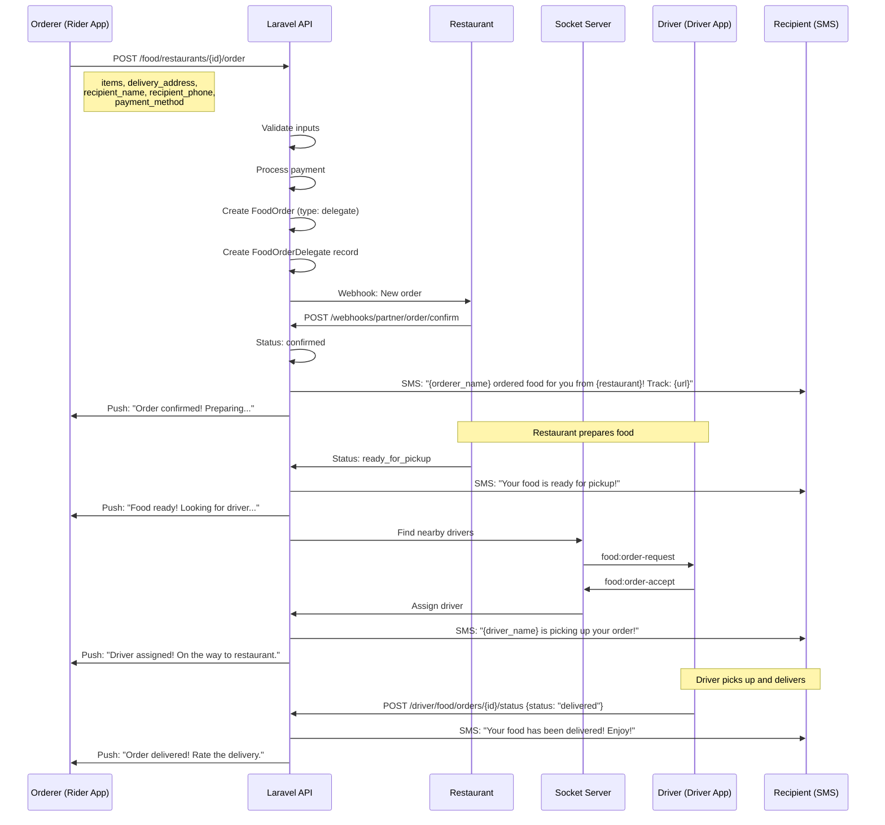
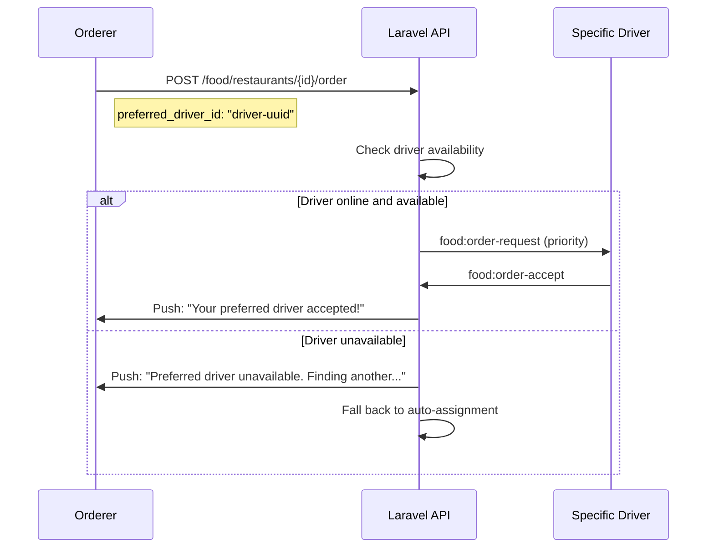
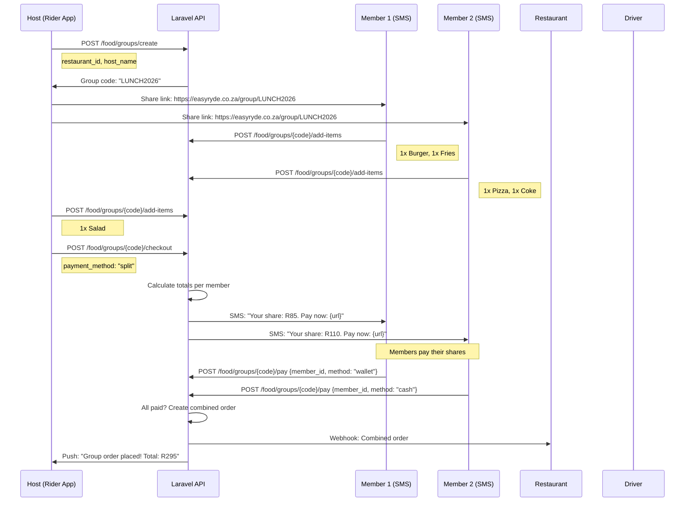
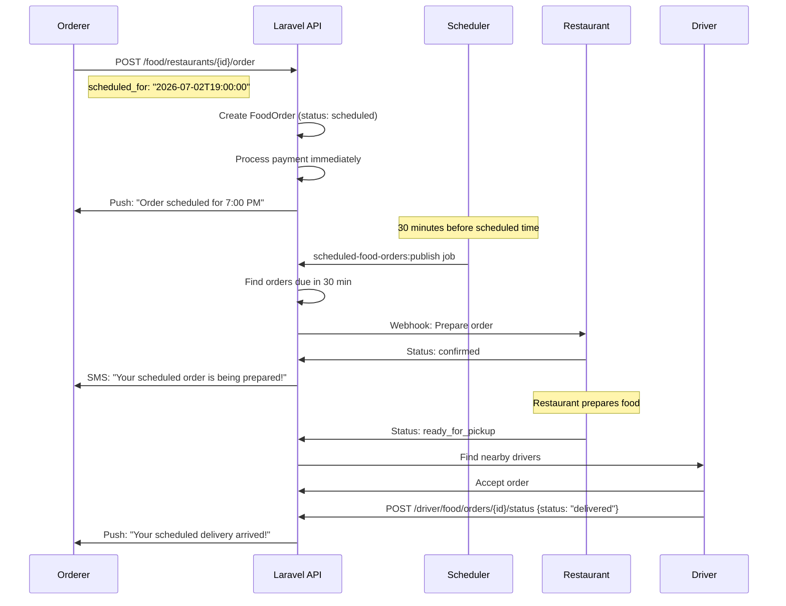

# Food Delegate Flow — EasyRyde

**Version:** 1.0.0
**Date:** 2026-07-02
**Status:** New feature specification

---

## 1. Overview

Allow users to order food for someone else, delegate delivery to specific drivers, support group ordering, and schedule deliveries. Extends the existing food delivery flow.

---

## 2. Actors

| Actor | Role | App |
|-------|------|-----|
| Orderer | Person placing and paying for order | Rider App |
| Recipient | Person receiving the food | SMS (no app required) |
| Driver | Person delivering the food | Driver App |
| Restaurant | Person preparing the food | Web (partner) |
| Admin | Monitor and support | Admin App |

---

## 3. User Stories

1. **Order for Someone Else:** "I want to order food for my mom who doesn't have the app"
2. **Delegate to Specific Driver:** "I want my usual driver to deliver my food"
3. **Group Ordering:** "I want to order lunch for the office and everyone pays their share"
4. **Scheduled Delivery:** "I want to order dinner for 7pm tonight"

---

## 4. Flow A: Order for Someone Else



### 4.1 API Request

```json
POST /food/restaurants/{restaurant_id}/order
Authorization: Bearer {orderer_token}

{
  "items": [
    {
      "menu_item_id": "uuid-1",
      "quantity": 2,
      "special_instructions": "No onions"
    }
  ],
  "delivery_address": "789 Pine Rd, Phalaborwa",
  "delivery_latitude": -23.8850,
  "delivery_longitude": 29.4550,
  "payment_method": "wallet",
  "type": "delegate",
  "recipient_name": "Mama Mokoena",
  "recipient_phone": "+27821234567",
  "note_to_driver": "Please ring doorbell twice"
}
```

### 4.2 Recipient Experience (No App)

**SMS on Order Placed:**
```
Hi Mama! Sarah ordered food for you from Joe's Pizza.

2x Margherita Pizza
Delivery: 789 Pine Rd

Track: https://track.easyryde.co.za/food/order/xyz789

EasyRyde
```

**SMS on Food Ready:**
```
Your food from Joe's Pizza is ready!

Driver is on the way to pick it up.
ETA: 20 minutes

Track: https://track.easyryde.co.za/food/order/xyz789

EasyRyde
```

**SMS on Delivered:**
```
Your food has been delivered!

Enjoy your meal from Joe's Pizza!

EasyRyde
```

---

## 5. Flow B: Delegate to Specific Driver



### 5.1 Driver Availability Check

```php
// OrderService::delegateToDriver()
public function delegateToDriver(FoodOrder $order, string $driverId)
{
    $driver = Driver::findOrFail($driverId);
    
    // Check driver is online
    if (!$driver->is_online) {
        throw new \Exception('Driver is currently offline');
    }
    
    // Check driver is not on an active ride
    if ($driver->activeRide()->exists()) {
        throw new \Exception('Driver is currently on a ride');
    }
    
    // Check driver is within delivery radius
    $distance = $this->calculateDistance(
        $driver->currentLat(),
        $driver->currentLng(),
        $order->restaurant->latitude,
        $order->restaurant->longitude
    );
    
    if ($distance > 5000) { // 5km
        throw new \Exception('Driver is too far from restaurant');
    }
    
    // Assign driver
    $order->update([
        'driver_id' => $driverId,
        'assignment_type' => 'delegated',
    ]);
    
    // Notify driver with priority
    event(new FoodOrderAssigned($order, priority: true));
}
```

---

## 6. Flow C: Group Ordering



### 6.1 Group Order Data Model

```sql
CREATE TABLE food_groups (
    id UUID PRIMARY KEY DEFAULT gen_random_uuid(),
    code VARCHAR(10) UNIQUE NOT NULL,
    host_id UUID NOT NULL REFERENCES users(id),
    restaurant_id UUID NOT NULL REFERENCES restaurants(id),
    status VARCHAR(50) DEFAULT 'collecting', -- collecting, checkout, placed, delivered
    total_amount DECIMAL(10,2),
    created_at TIMESTAMP DEFAULT NOW()
);

CREATE TABLE food_group_members (
    id UUID PRIMARY KEY DEFAULT gen_random_uuid(),
    group_id UUID NOT NULL REFERENCES food_groups(id),
    user_id UUID REFERENCES users(id), -- null if guest
    name VARCHAR(255) NOT NULL,
    phone VARCHAR(20),
    items JSONB NOT NULL,
    share_amount DECIMAL(10,2),
    payment_status VARCHAR(50) DEFAULT 'pending',
    payment_method VARCHAR(50),
    created_at TIMESTAMP DEFAULT NOW()
);
```

---

## 7. Flow D: Scheduled Delivery



### 7.1 Scheduler Implementation

```php
// ScheduledFoodOrdersPublishJob (runs every minute)
public function handle()
{
    $dueOrders = FoodOrder::where('status', 'scheduled')
        ->where('scheduled_for', '<=', now()->addMinutes(30))
        ->get();
    
    foreach ($dueOrders as $order) {
        // Update status to placed
        $order->update(['status' => 'placed']);
        
        // Notify restaurant
        $this->restaurantService->notifyNewOrder($order);
        
        // Notify customer
        Notification::send($order->customer, new ScheduledOrderPreparing($order));
    }
}
```

---

## 8. Socket.IO Events

| Event | Direction | Payload | Room |
|-------|-----------|---------|------|
| `food:order-request` | Server → Driver | order details | driver:{driverId} |
| `food:order-accept` | Driver → Server | orderId | food:{orderId} |
| `food:order-status` | Server → Orderer | status update | user:{ordererId} |
| `food:group-item-added` | Server → Group | member, items | group:{groupId} |
| `food:group-checkout` | Server → Group | totals | group:{groupId} |
| `food:delegate-assigned` | Server → Orderer | driver info | user:{ordererId} |

---

## 9. Database Changes

### New Tables

```sql
-- Food order delegates (order for someone else)
CREATE TABLE food_order_delegates (
    id UUID PRIMARY KEY DEFAULT gen_random_uuid(),
    food_order_id UUID NOT NULL REFERENCES food_orders(id),
    orderer_id UUID NOT NULL REFERENCES users(id),
    recipient_name VARCHAR(255) NOT NULL,
    recipient_phone VARCHAR(20) NOT NULL,
    tracking_token VARCHAR(64) UNIQUE NOT NULL,
    created_at TIMESTAMP DEFAULT NOW()
);

-- Group orders
CREATE TABLE food_groups (
    id UUID PRIMARY KEY DEFAULT gen_random_uuid(),
    code VARCHAR(10) UNIQUE NOT NULL,
    host_id UUID NOT NULL REFERENCES users(id),
    restaurant_id UUID NOT NULL REFERENCES restaurants(id),
    status VARCHAR(50) DEFAULT 'collecting',
    total_amount DECIMAL(10,2),
    created_at TIMESTAMP DEFAULT NOW()
);

CREATE TABLE food_group_members (
    id UUID PRIMARY KEY DEFAULT gen_random_uuid(),
    group_id UUID NOT NULL REFERENCES food_groups(id),
    user_id UUID REFERENCES users(id),
    name VARCHAR(255) NOT NULL,
    phone VARCHAR(20),
    items JSONB NOT NULL,
    share_amount DECIMAL(10,2),
    payment_status VARCHAR(50) DEFAULT 'pending',
    payment_method VARCHAR(50),
    created_at TIMESTAMP DEFAULT NOW()
);

-- Food order table changes
ALTER TABLE food_orders ADD COLUMN type VARCHAR(50) DEFAULT 'standard';
-- Values: 'standard', 'delegate', 'group', 'scheduled'
ALTER TABLE food_orders ADD COLUMN scheduled_for TIMESTAMP;
ALTER TABLE food_orders ADD COLUMN preferred_driver_id UUID REFERENCES users(id);
ALTER TABLE food_orders ADD COLUMN assignment_type VARCHAR(50);
-- Values: 'auto', 'delegated', 'preferred'
```

---

## 10. API Endpoints

| Endpoint | Method | Auth | Purpose |
|----------|--------|------|---------|
| `/food/restaurants/{id}/order` | POST | Sanctum | Create order (with delegate fields) |
| `/food/groups/create` | POST | Sanctum | Create group order |
| `/food/groups/{code}` | GET | Sanctum | Get group order details |
| `/food/groups/{code}/add-items` | POST | Sanctum/Guest | Add items to group |
| `/food/groups/{code}/checkout` | POST | Sanctum (host) | Finalize group order |
| `/food/groups/{code}/pay` | POST | Sanctum/Guest | Pay member's share |
| `/food/orders/{id}/delegate` | GET | Sanctum | Get delegate info |
| `/food/orders/{id}/track` | GET | Public | Public tracking page |

---

## 11. Edge Cases

| Edge Case | Handling |
|-----------|----------|
| Recipient phone not registered | Allow (SMS tracking works) |
| Recipient phone is another user | Allow (they can track via SMS) |
| Group member doesn't pay | Host can remove member or pay for them |
| Host leaves group | Transfer host to another member |
| Restaurant closes before scheduled time | Refund and notify |
| Preferred driver declines | Fall back to auto-assignment |
| Group order > restaurant capacity | Split across restaurants (future) |
| Delivery to different addresses | Not supported (same address for group) |

---

## 12. Validation Rules

| Field | Rule | Error |
|-------|------|-------|
| recipient_name | Required if type=delegate, 2-100 chars | "Enter recipient name" |
| recipient_phone | Required if type=delegate, valid SA format | "Enter valid phone" |
| scheduled_for | Must be future, min 1 hour ahead | "Schedule at least 1 hour ahead" |
| preferred_driver_id | Must be online and available | "Driver unavailable" |
| group code | 6 alphanumeric, unique | Auto-generated |

---

## 13. Cost Estimate

| Item | Monthly Cost |
|------|-------------|
| SMS (1000 delegate orders × 3 SMS) | R1,500 |
| Tracking page hosting | R200 |
| Development (20 days) | R100,000 |
| **Total** | **R101,700** |

---

## 14. Implementation Priority

| # | Task | Effort | Flow |
|---|------|--------|------|
| 1 | Database migrations | 1 day | All |
| 2 | Delegate order flow (backend) | 3 days | A |
| 3 | Delegate order flow (mobile) | 2 days | A |
| 4 | SMS templates + service | 1 day | A |
| 5 | Public tracking page | 1 day | A |
| 6 | Preferred driver delegation | 2 days | B |
| 7 | Group order backend | 4 days | C |
| 8 | Group order mobile | 3 days | C |
| 9 | Scheduled delivery | 2 days | D |
| 10 | Testing | 3 days | All |

**Total:** ~22 days (1 developer)
