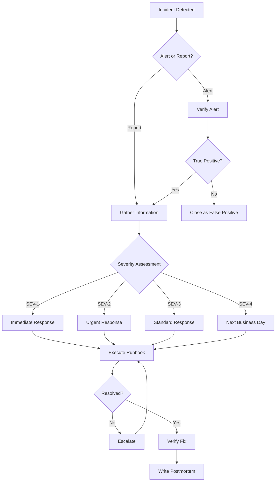

# Incident Response Runbook — EasyRyde

**Version:** 1.0.0
**Date:** 2026-07-02
**Status:** Pre-launch operational runbook

---

## 1. Overview

Step-by-step procedures for responding to production incidents. Every incident has a clear owner, timeline, and resolution path. No guessing at 3am.

---

## 2. Incident Severity Levels

| Level | Name | Description | Response Time | Examples |
|-------|------|-------------|---------------|----------|
| **SEV-1** | Critical | System down, data loss, security breach | 15 minutes | DB down, Redis down, payment data leak |
| **SEV-2** | Major | Core feature broken, significant impact | 30 minutes | Ride matching broken, payment failures |
| **SEV-3** | Minor | Feature degraded, workaround exists | 2 hours | Slow API, push notifications failing |
| **SEV-4** | Low | Cosmetic issue, no user impact | Next business day | UI bug, typo, non-critical log errors |

---

## 3. Incident Response Flow



---

## 4. SEV-1: Database Down

### Detection
- All API calls returning 500
- PostgreSQL health check failing
- Sentry flooding with database errors

### Immediate Actions (15 minutes)

```bash
# 1. Check PostgreSQL status
docker exec easyryde-database pg_isready

# 2. Check connection count
docker exec easyryde-database psql -U postgres -c "SELECT count(*) FROM pg_stat_activity;"

# 3. Check for locks
docker exec easyryde-database psql -U postgres -c "SELECT * FROM pg_locks WHERE NOT granted;"

# 4. Check disk space
docker exec easyryde-database df -h /var/lib/postgresql/data

# 5. Check PostgreSQL logs
docker logs easyryde-database --tail 100
```

### Resolution Steps

```bash
# If connection pool exhausted
docker exec easyryde-database psql -U postgres -c "SELECT pg_terminate_backend(pid) FROM pg_stat_activity WHERE state = 'idle' AND query_start < NOW() - INTERVAL '5 minutes';"

# If disk full
docker exec easyryde-database psql -U postgres -c "VACUUM FULL;"

# If corrupted
# LAST RESORT: Restore from backup
docker exec easyryde-database pg_restore -U postgres -d easyryde /backups/latest.dump
```

### Rollback
1. Restore PostgreSQL from last known good backup
2. Verify data integrity
3. Restart API server

### Communication
- **Internal:** "Database incident. Investigating. ETA 30 min."
- **External (if needed):** "We're experiencing technical difficulties. Service will resume shortly."

---

## 5. SEV-1: Redis Down

### Detection
- Queue jobs piling up
- Cache misses spiking
- Socket.IO events lost
- Session validation failing

### Immediate Actions (15 minutes)

```bash
# 1. Check Redis status
docker exec easyryde-redis redis-cli ping

# 2. Check memory usage
docker exec easyryde-redis redis-cli info memory

# 3. Check connected clients
docker exec easyryde-redis redis-cli info clients

# 4. Check for slow queries
docker exec easyryde-redis slowlog get 10

# 5. Check Redis logs
docker logs easyryde-redis --tail 100
```

### Resolution Steps

```bash
# If memory full
docker exec easyryde-redis redis-cli FLUSHDB  # Nuclear option

# If slow queries
docker exec easyryde-redis redis-cli CONFIG SET slowlog-log-slower-than 10000

# If connection refused
docker restart easyryde-redis
```

### Recovery
1. Redis restart → clients auto-reconnect
2. Queue jobs resume processing
3. Socket.IO clients reconnect (exponential backoff)
4. Verify no duplicate payments from queue retry

---

## 6. SEV-2: Ride Matching Broken

### Detection
- No ride requests being sent to drivers
- Riders stuck on "Searching for driver..."
- Socket.IO `ride:request` events not firing

### Immediate Actions (30 minutes)

```bash
# 1. Check Socket.IO server status
curl -s http://localhost:3001/health

# 2. Check Redis GEO data
docker exec easyryde-redis redis-cli GEOSEARCH driver:location FROMLATLON -23.9045 29.4688 BYRADIUS 5000 m

# 3. Check Socket.IO connections
curl -s http://localhost:3001/connections

# 4. Check Socket.IO logs
docker logs easyryde-socket --tail 100

# 5. Test ride request manually
curl -X POST http://localhost:3001/test/ride-request
```

### Resolution Steps

```bash
# If Socket.IO down
docker restart easyryde-socket

# If Redis GEO empty (drivers not updating)
# Check driver location updates are working
docker exec easyryde-redis redis-cli ZRANGE driver:location 0 -1 WITHSCORES

# If Lua script failing
# Check Redis Lua script cache
docker exec easyryde-redis redis-cli EVAL "return redis.call('keys','*')" 0
```

---

## 7. SEV-2: Payment Processing Failures

### Detection
- Payment success rate drops below 98%
- Webhook signatures failing
- Wallet balance discrepancies

### Immediate Actions (30 minutes)

```bash
# 1. Check payment queue
curl -s http://localhost:9000/horizon/api/metrics/jobs/per-minute

# 2. Check webhook logs
docker logs easyryde-backend --tail 200 | grep "webhook"

# 3. Check Stripe/PayFast status
curl -s https://status.stripe.com/api/v2/status.json
curl -s https://status.payfast.co.za/

# 4. Check wallet balances
docker exec easyryde-database psql -U postgres -c "SELECT user_id, balance FROM wallets WHERE balance < 0;"

# 5. Check for duplicate payments
docker exec easyryde-database psql -U postgres -c "SELECT ride_id, COUNT(*) FROM payments GROUP BY ride_id HAVING COUNT(*) > 1;"
```

### Resolution Steps

```bash
# If webhook failing
# 1. Check webhook endpoint
curl -X POST http://localhost:9000/webhooks/stripe -H "Content-Type: application/json" -d '{}'
# 2. Verify signature secret is correct
# 3. Check for IP whitelist issues

# If wallet discrepancy
# 1. Run reconciliation
docker exec easyryde-backend php artisan wallet:reconcile
# 2. Manual adjustment if needed
docker exec easyryde-database psql -U postgres -c "UPDATE wallets SET balance = balance + 100 WHERE user_id = 'uuid';"
```

---

## 8. SEV-2: Socket.IO Server Down

### Detection
- No real-time updates
- Drivers can't receive ride requests
- Riders can't track drivers
- Chat messages not delivered

### Immediate Actions (30 minutes)

```bash
# 1. Check Socket.IO server
curl -s http://localhost:3001/health
docker ps | grep socket

# 2. Check Node.js process
docker exec easyryde-socket ps aux | grep node

# 3. Check memory usage
docker exec easyryde-socket free -m

# 4. Check Socket.IO logs
docker logs easyryde-socket --tail 100

# 5. Check Redis connection from Socket.IO
docker exec easyryde-socket redis-cli -h redis ping
```

### Resolution Steps

```bash
# If OOM killed
docker restart easyryde-socket

# If unresponsive
docker kill easyryde-socket
docker start easyryde-socket

# If memory leak suspected
docker exec easyryde-socket node --max-old-space-size=1024
```

### Recovery
1. Socket.IO server restarts
2. Clients auto-reconnect (exponential backoff)
3. Drivers re-register location
4. Pending ride requests retry

---

## 9. SEV-3: Slow API Response

### Detection
- API p95 latency > 500ms
- Users complaining about slow loading
- Timeout errors increasing

### Investigation Steps

```bash
# 1. Check API response time
curl -w "@curl-timing.txt" -o /dev/null -s http://localhost:9000/health

# 2. Check database slow queries
docker exec easyryde-database psql -U postgres -c "SELECT query, calls, mean_exec_time, total_exec_time FROM pg_stat_statements ORDER BY mean_exec_time DESC LIMIT 10;"

# 3. Check Redis latency
docker exec easyryde-redis redis-cli --latency

# 4. Check CPU usage
docker stats easyryde-backend --no-stream

# 5. Check queue depth
curl -s http://localhost:9000/horizon/api/metrics/jobs/per-minute
```

### Resolution Steps

```bash
# If database slow
docker exec easyryde-database psql -U postgres -c "ANALYZE;"
docker exec easyryde-database psql -U postgres -c "VACUUM;"

# If Redis slow
docker exec easyryde-redis redis-cli SLOWLOG RESET

# If CPU high
docker-compose -f docker-compose.prod.yml up -d --scale backend=3

# If memory high
docker restart easyryde-backend
```

---

## 10. SEV-3: Push Notifications Failing

### Detection
- Users not receiving ride alerts
- FCM delivery rate drops
- Notification queue piling up

### Investigation Steps

```bash
# 1. Check FCM configuration
docker exec easyryde-backend php artisan notification:test

# 2. Check notification queue
docker exec easyryde-backend php artisan queue:work --once --queue=notifications

# 3. Check invalid tokens
docker exec easyryde-database psql -U postgres -c "SELECT COUNT(*) FROM push_tokens WHERE is_active = false;"

# 4. Check SendGrid/Twilio status
curl -s https://status.sendgrid.com/api/v2/summary.json
```

### Resolution Steps

```bash
# If FCM token invalid
# 1. Verify Firebase credentials
# 2. Regenerate FCM server key
# 3. Update in .env

# If queue stuck
docker exec easyryde-backend php artisan queue:restart

# If invalid tokens
docker exec easyryde-database psql -U postgres -c "UPDATE push_tokens SET is_active = false WHERE updated_at < NOW() - INTERVAL '30 days';"
```

---

## 11. SEV-4: UI Bug (No User Impact)

### Process
1. Document the bug (screenshot, steps to reproduce)
2. Create GitHub issue with severity label
3. Assign to next sprint
4. No immediate action required

---

## 12. Escalation Matrix

| Level | Who | Contact | When |
|-------|-----|---------|------|
| **L1** | On-call engineer | Phone + Slack | First responder |
| **L2** | Backend lead | Phone + Slack | SEV-1/2, 15 min after L1 |
| **L3** | CTO | Phone + Slack | SEV-1, 30 min after L2 |
| **L4** | External support | Email + Phone | When internal can't resolve |

### External Support Contacts

| Service | Support | Phone |
|---------|---------|-------|
| Stripe | support@stripe.com | +1-888-926-3427 |
| PayFast | support@payfast.co.za | +27 21 529 7555 |
| Twilio | support@twilio.com | +1-877-821-4124 |
| Firebase | support@firebase.google.com | N/A |
| DigitalOcean | support@digitalocean.com | N/A |

---

## 13. Communication Templates

### Internal (Slack)

**SEV-1:**
```
🔴 SEV-1 INCIDENT: [Brief description]
- Status: Investigating
- Impact: [What's affected]
- ETA: [Time to resolution]
- Incident lead: [Name]
- War room: #incident-[number]
```

**SEV-2:**
```
🟡 SEV-2 INCIDENT: [Brief description]
- Status: Investigating
- Impact: [What's affected]
- ETA: [Time to resolution]
- Incident lead: [Name]
```

### External (User-facing)

**Service Degradation:**
```
We're experiencing [brief description of issue]. 
Our team is working to resolve it. 
We'll update you in [X] minutes.
Thank you for your patience.
- EasyRyde Team
```

**Service Restored:**
```
The issue has been resolved. 
[What was affected] is now working normally.
We apologize for the inconvenience.
- EasyRyde Team
```

---

## 14. Post-Incident Process

### Within 24 hours
1. Write incident summary
2. Identify root cause
3. Create action items

### Within 1 week
1. Complete postmortem
2. Implement preventive measures
3. Update runbook if needed
4. Share learnings with team

### Postmortem Template

```markdown
# Incident Postmortem: [Title]

## Summary
- **Date:** [Date]
- **Duration:** [X] hours
- **Severity:** [SEV-X]
- **Impact:** [What was affected]
- **Resolution:** [How it was fixed]

## Timeline
| Time | Event |
|------|-------|
| [time] | Incident detected |
| [time] | Investigation started |
| [time] | Root cause identified |
| [time] | Fix deployed |
| [time] | Incident resolved |

## Root Cause
[Detailed root cause analysis]

## What Went Well
- [thing 1]
- [thing 2]

## What Went Wrong
- [thing 1]
- [thing 2]

## Action Items
| # | Action | Owner | Deadline | Status |
|---|--------|-------|----------|--------|
| 1 | [action] | [owner] | [date] | [status] |

## Lessons Learned
- [lesson 1]
- [lesson 2]
```

---

## 15. On-Call Rotation

| Week | Primary | Backup | Phone |
|------|---------|--------|-------|
| Week 1 | [Name] | [Name] | [Number] |
| Week 2 | [Name] | [Name] | [Number] |
| Week 3 | [Name] | [Name] | [Number] |
| Week 4 | [Name] | [Name] | [Number] |

### On-Call Responsibilities
1. Monitor alerts (PagerDuty/Slack)
2. Respond within 15 minutes for SEV-1
3. Execute runbook
4. Escalate if needed
5. Write postmortem

---

## 16. Monitoring & Alerting Setup

### Prometheus Alerts

```yaml
groups:
  - name: easyryde
    rules:
      - alert: APIHighLatency
        expr: http_request_duration_seconds{quantile="0.95"} > 0.5
        for: 5m
        labels:
          severity: warning
        annotations:
          summary: "API p95 latency > 500ms"
      
      - alert: APIHighErrorRate
        expr: rate(http_requests_total{status=~"5.."}[5m]) > 0.01
        for: 2m
        labels:
          severity: critical
        annotations:
          summary: "API error rate > 1%"
      
      - alert: DatabaseConnectionsHigh
        expr: pg_stat_activity_count > 80
        for: 5m
        labels:
          severity: warning
        annotations:
          summary: "PostgreSQL connections > 80"
      
      - alert: RedisMemoryHigh
        expr: redis_memory_used_bytes / redis_memory_max_bytes > 0.85
        for: 5m
        labels:
          severity: warning
        annotations:
          summary: "Redis memory > 85%"
      
      - alert: QueueDepthHigh
        expr: horizon_queue_depth > 100
        for: 10m
        labels:
          severity: warning
        annotations:
          summary: "Queue depth > 100"
      
      - alert: PaymentFailureRateHigh
        expr: rate(payment_failures_total[5m]) > 0.02
        for: 5m
        labels:
          severity: critical
        annotations:
          summary: "Payment failure rate > 2%"
```

### Grafana Alerting

```json
{
  "alert": {
    "name": "API High Latency",
    "condition": "avg(api_response_time_p95) > 500",
    "frequency": "5m",
    "notifications": ["slack-incidents"]
  }
}
```

---

## 17. Backup & Recovery

### Backup Schedule

| Data | Frequency | Retention | Location |
|------|-----------|-----------|----------|
| PostgreSQL | Daily 2am | 30 days | S3 + local |
| Redis | Every 6 hours | 7 days | S3 |
| Application logs | Real-time | 90 days | Loggly |
| Sentry errors | Real-time | 1 year | Sentry |
| Configuration | On change | Forever | Git |

### Recovery Time Objectives

| Component | RTO | RPO |
|-----------|-----|-----|
| PostgreSQL | 30 minutes | 24 hours |
| Redis | 5 minutes | 6 hours |
| Socket.IO | 5 minutes | 0 (stateless) |
| API Server | 5 minutes | 0 (stateless) |
| Full System | 1 hour | 24 hours |

### Recovery Steps

```bash
# PostgreSQL recovery
docker exec easyryde-database pg_restore -U postgres -d easyryde /backups/latest.dump

# Redis recovery
docker exec easyryde-redis redis-cli --rdb /backups/dump.rdb

# Full system recovery
docker-compose -f docker-compose.prod.yml down
docker-compose -f docker-compose.prod.yml up -d
```
