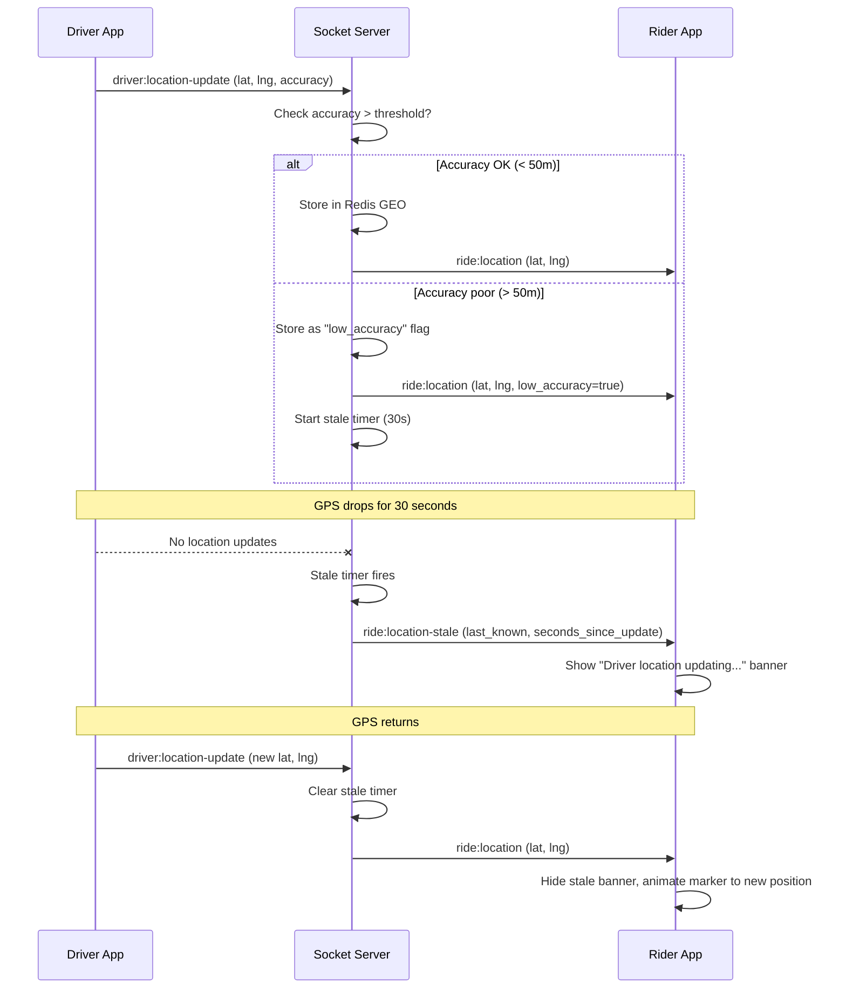
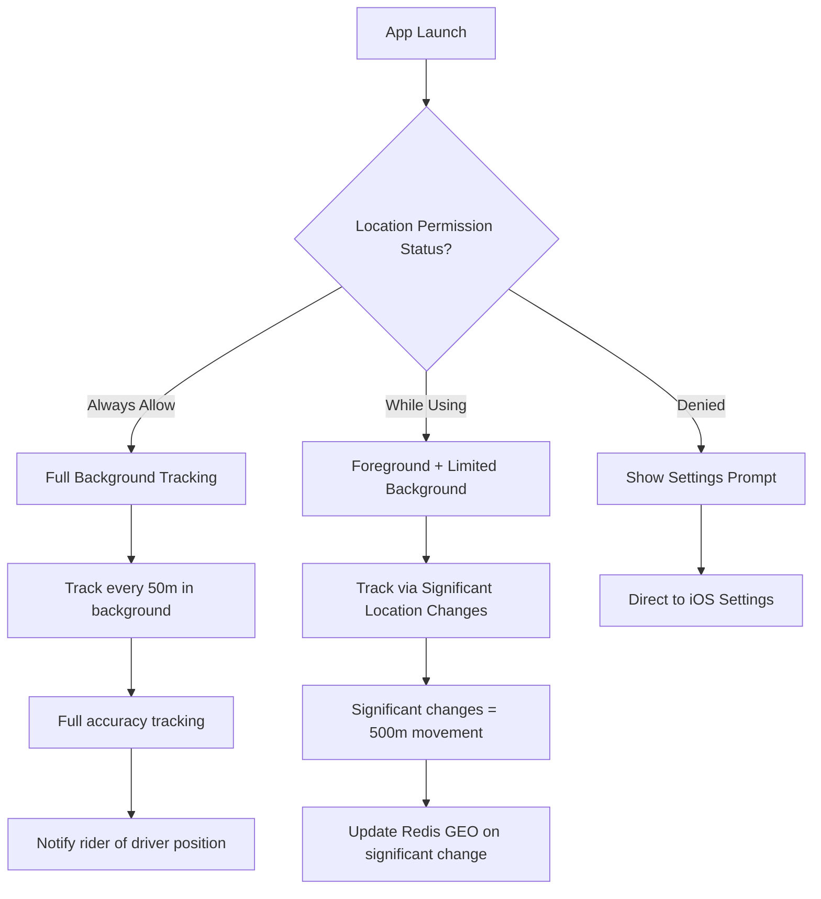
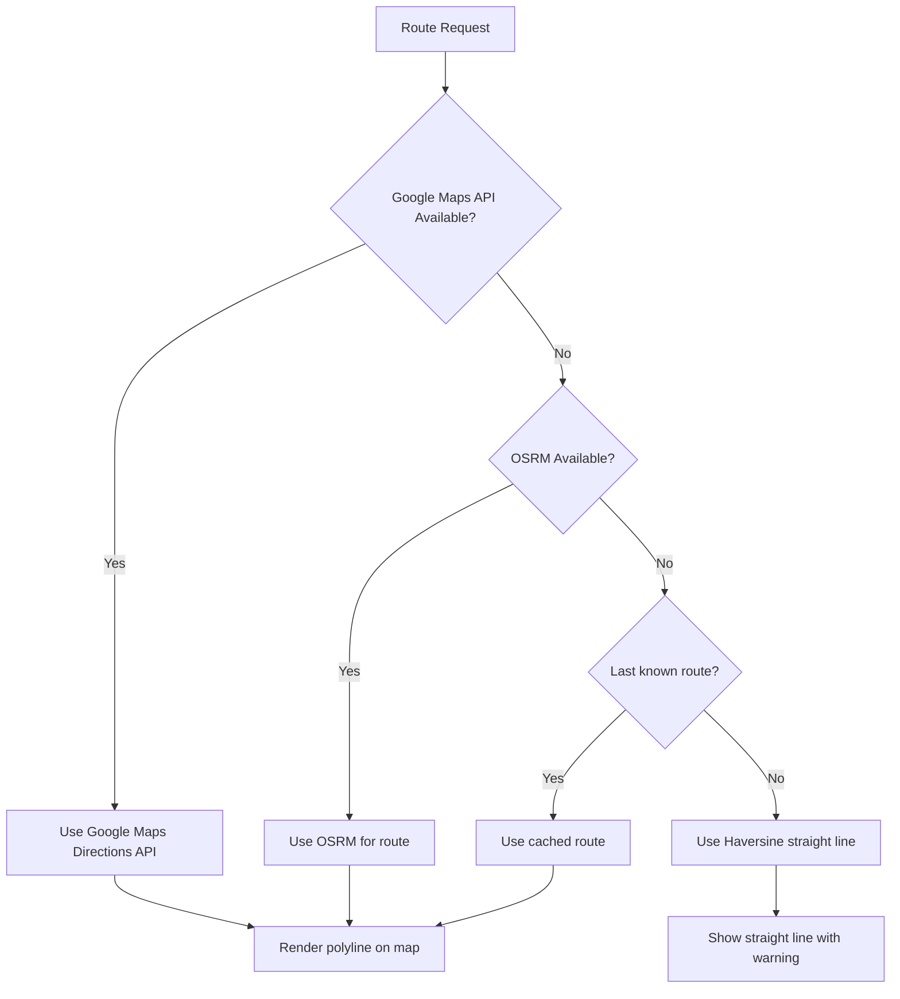

# Real-Time Location Hardening — EasyRyde

**Version:** 1.0.0
**Date:** 2026-07-02
**Status:** Pre-launch hardening plan

---

## 1. Current State Assessment

The current GPS tracking implementation is **fragile**. It works in ideal conditions but has multiple failure modes that will cause real problems in production Phalaborwa conditions.

### What Exists
- Driver emits `driver:location-update` every 50m distance interval
- Server stores in Redis GEO (`GEOADD driver:location`)
- Server broadcasts `ride:location` to rider room
- Background location via `AppState` listener

### What's Broken
1. **No GPS drop handling** — If location drops mid-ride, rider sees frozen driver marker
2. **No battery mitigation** — Continuous tracking drains battery 15-20%/hour
3. **iOS background location** — Denied = foreground only, no tracking when app backgrounded
4. **No geofencing** — Surge zones exist but no automatic detection
5. **No stale data cleanup** — Old driver locations stay in Redis forever
6. **No accuracy filtering** — GPS drift (50-100m) causes driver marker to jump
7. **No fallback when Google Maps down** — Maps API failure = no route visualization

---

## 2. GPS Drop Handling

### Problem
When driver's GPS signal drops (tunnel, building, bad weather), the rider sees a frozen driver marker. The driver continues moving but the map doesn't update. Rider panics, calls driver, creates support tickets.

### Solution



### Implementation

**Driver App Changes:**
```typescript
// Track GPS accuracy
const locationSubscription = await Location.watchPositionAsync(
  {
    accuracy: Location.Accuracy.Balanced,
    distanceInterval: 50,
    timeInterval: 10000,
  },
  (location) => {
    const { latitude, longitude, accuracy } = location.coords;
    
    // Send accuracy with location update
    socket.emit('driver:location-update', {
      lat: latitude,
      lng: longitude,
      accuracy: accuracy || 0,
      timestamp: Date.now(),
    });
  }
);
```

**Socket Server Changes:**
```typescript
// Handle location with accuracy check
socket.on('driver:location-update', (data) => {
  const { lat, lng, accuracy, timestamp } = data;
  
  // Filter out bad GPS readings
  if (accuracy > 100) {
    // Still store but flag as low accuracy
    redis.geoadd('driver:location', lng, lat, driverId);
    redis.hset(`driver:location:${driverId}`, 'low_accuracy', '1');
  } else {
    redis.geoadd('driver:location', lng, lat, driverId);
    redis.hset(`driver:location:${driverId}`, 'low_accuracy', '0');
  }
  
  // Update last seen timestamp
  redis.hset(`driver:location:${driverId}`, 'last_seen', Date.now());
  
  // Broadcast to rider in active ride
  const rideId = await getActiveRideId(driverId);
  if (rideId) {
    io.to(`ride:${rideId}`).emit('ride:location', {
      lat,
      lng,
      accuracy,
      low_accuracy: accuracy > 50,
    });
  }
});

// Stale location detector (runs every 10 seconds)
setInterval(async () => {
  const now = Date.now();
  const staleThreshold = 30000; // 30 seconds
  
  // Find all online drivers
  const onlineDrivers = await redis.smembers('drivers:online');
  
  for (const driverId of onlineDrivers) {
    const lastSeen = await redis.hget(`driver:location:${driverId}`, 'last_seen');
    if (lastSeen && now - parseInt(lastSeen) > staleThreshold) {
      // Driver location is stale
      const rideId = await getActiveRideId(driverId);
      if (rideId) {
        const lastLocation = await redis.geopos('driver:location', driverId);
        io.to(`ride:${rideId}`).emit('ride:location-stale', {
          last_known: { lat: lastLocation[1], lng: lastLocation[0] },
          seconds_since_update: Math.floor((now - parseInt(lastSeen)) / 1000),
        });
      }
    }
  }
}, 10000);
```

---

## 3. Battery Drain Mitigation

### Problem
Continuous GPS tracking at high accuracy drains battery 15-20%/hour. Drivers won't stay online if their phone dies in 4 hours.

### Solution: Adaptive Tracking Modes

| Mode | Accuracy | Interval | Battery Impact | When Used |
|------|----------|----------|----------------|-----------|
| **Active Ride** | High (10m) | Every 50m / 5s | High | During trip |
| **To Pickup** | Medium (30m) | Every 100m / 10s | Medium | En route to rider |
| **Online (Idle)** | Low (100m) | Every 200m / 30s | Low | Waiting for requests |
| **Offline** | None | None | None | Not accepting rides |

### Implementation

**Driver App:**
```typescript
// Adaptive tracking based on ride state
const getTrackingConfig = (rideState: RideState) => {
  switch (rideState) {
    case 'in_progress':
      return {
        accuracy: Location.Accuracy.High,
        distanceInterval: 50,
        timeInterval: 5000,
      };
    case 'to_pickup':
      return {
        accuracy: Location.Accuracy.Balanced,
        distanceInterval: 100,
        timeInterval: 10000,
      };
    case 'online_idle':
      return {
        accuracy: Location.Accuracy.Low,
        distanceInterval: 200,
        timeInterval: 30000,
      };
    default:
      return null; // Stop tracking
  }
};

// Switch modes when ride state changes
useEffect(() => {
  const config = getTrackingConfig(rideState);
  if (config) {
    startLocationTracking(config);
  } else {
    stopLocationTracking();
  }
}, [rideState]);
```

**Battery Impact Estimate:**
| Mode | Hours to Drain 50% Battery |
|------|---------------------------|
| Active Ride (continuous) | ~3 hours |
| Active Ride (adaptive) | ~5 hours |
| Online Idle | ~10 hours |
| Offline | ~20 hours |

---

## 4. iOS Background Location

### Problem
iOS restricts background location. If user denies "Always Allow" permission, tracking stops when app is backgrounded. Drivers switching to WhatsApp or taking calls lose tracking.

### Solution: Tiered Permission Strategy



**Implementation:**
```typescript
// Request permissions strategically
const requestLocationPermission = async () => {
  const { status: foregroundStatus } = await Location.requestForegroundPermissionsAsync();
  
  if (foregroundStatus === 'granted') {
    // Try to get background permission
    const { status: backgroundStatus } = await Location.requestBackgroundPermissionsAsync();
    
    if (backgroundStatus === 'granted') {
      return 'full'; // Full background tracking
    } else {
      return 'foreground'; // Foreground + significant changes
    }
  }
  
  return 'denied';
};

// For foreground-only mode: use significant location changes
if (permissionLevel === 'foreground') {
  Location.watchPositionAsync(
    {
      accuracy: Location.Accuracy.Balanced,
      distanceInterval: 500, // Significant changes only
      timeInterval: 60000, // At least once per minute
    },
    handleLocationUpdate
  );
}
```

---

## 5. Surge Zone Geofencing

### Problem
Surge zones exist in admin but there's no automatic detection. A driver enters a surge zone and the fare multiplier doesn't apply automatically.

### Solution: Redis GEO-based Geofencing

```typescript
// On every location update, check surge zones
const checkSurgeZones = async (lat: number, lng: number) => {
  // Get all active surge zones
  const zones = await redis.get('surge:zones:active');
  if (!zones) return null;
  
  for (const zone of JSON.parse(zones)) {
    // Check if location is within zone radius
    const distance = redis.geodist(
      'surge:zone:' + zone.id,
      lng, lat,
      'm'
    );
    
    if (distance <= zone.radius) {
      return {
        zone_id: zone.id,
        multiplier: zone.multiplier,
        zone_name: zone.name,
      };
    }
  }
  
  return null;
};

// On location update
socket.on('driver:location-update', async (data) => {
  const { lat, lng } = data;
  
  // Store location
  await redis.geoadd('driver:location', lng, lat, driverId);
  
  // Check surge zones
  const surge = await checkSurgeZones(lat, lng);
  if (surge) {
    socket.emit('surge:entered-zone', surge);
  }
});
```

---

## 6. Stale Location Cleanup

### Problem
Driver locations stay in Redis GEO forever. Old offline drivers appear in searches. Redis memory grows unbounded.

### Solution: TTL-based Cleanup

```typescript
// On driver go offline
socket.on('driver:toggle-online', async (data) => {
  if (!data.is_online) {
    // Remove from online set
    await redis.srem('drivers:online', driverId);
    
    // Set TTL on location data (24 hours)
    await redis.expire('driver:location:' + driverId, 86400);
    
    // Remove from GEO index
    await redis.zrem('driver:location', driverId);
  } else {
    // Add back to online set
    await redis.sadd('drivers:online', driverId);
    
    // Remove TTL
    await redis.persist('driver:location:' + driverId);
  }
});

// Periodic cleanup job (runs every hour)
const cleanupStaleLocations = async () => {
  const staleThreshold = Date.now() - (24 * 60 * 60 * 1000); // 24 hours
  
  const allDrivers = await redis.zrangebyscore('driver:location', 0, staleThreshold);
  for (const driverId of allDrivers) {
    await redis.zrem('driver:location', driverId);
  }
};
```

---

## 7. Google Maps API Fallback

### Problem
If Google Maps API is down, route visualization breaks completely. No map, no route, no ETA.

### Solution: Multi-layer Fallback



**Implementation:**
```typescript
const getRoute = async (pickup: LatLng, dropoff: LatLng) => {
  // Try Google Maps first
  try {
    const googleRoute = await getGoogleRoute(pickup, dropoff);
    if (googleRoute) return googleRoute;
  } catch (e) {
    console.warn('Google Maps API failed, trying OSRM');
  }
  
  // Fallback to OSRM
  try {
    const osrmRoute = await getOSRMRoute(pickup, dropoff);
    if (osrmRoute) return osrmRoute;
  } catch (e) {
    console.warn('OSRM failed, using Haversine fallback');
  }
  
  // Final fallback: Haversine
  const distance = haversineDistance(pickup, dropoff);
  const duration = (distance / 30) * 60; // Assume 30 km/h
  
  return {
    distance,
    duration,
    polyline: null, // No polyline available
    fallback: true,
  };
};
```

---

## 8. Location Accuracy Filtering

### Problem
GPS readings jump 50-100m due to atmospheric conditions, urban canyons, and device quality. Driver marker appears to teleport.

### Solution: Kalman Filter

```typescript
// Simple Kalman filter for GPS smoothing
class KalmanFilter {
  private Q = 0.01; // Process noise
  private R = 0.5;  // Measurement noise
  private P = 1;    // Estimation error
  private K = 0;    // Kalman gain
  private X = 0;    // Value

  update(measurement: number): number {
    this.P += this.Q;
    this.K = this.P / (this.P + this.R);
    this.X += this.K * (measurement - this.X);
    this.P *= (1 - this.K);
    return this.X;
  }
}

// Apply to location updates
const latFilter = new KalmanFilter();
const lngFilter = new KalmanFilter();

socket.on('driver:location-update', (data) => {
  const smoothedLat = latFilter.update(data.lat);
  const smoothedLng = lngFilter.update(data.lng);
  
  // Use smoothed coordinates
  redis.geoadd('driver:location', smoothedLng, smoothedLat, driverId);
});
```

---

## 9. Implementation Priority

| # | Feature | Effort | Impact | Priority |
|---|---------|--------|--------|----------|
| 1 | GPS accuracy filtering (Kalman) | 2 days | High | CRITICAL |
| 2 | Stale location detection + notification | 2 days | High | CRITICAL |
| 3 | Adaptive tracking modes (battery) | 3 days | High | CRITICAL |
| 4 | iOS background location tiering | 2 days | Medium | HIGH |
| 5 | Surge zone geofencing | 2 days | Medium | HIGH |
| 6 | Stale location cleanup (Redis TTL) | 1 day | Medium | HIGH |
| 7 | Google Maps API fallback | 2 days | Medium | HIGH |
| 8 | Location accuracy UI indicators | 1 day | Low | MEDIUM |

**Total effort:** ~15 days (1 developer)

---

## 10. Testing Requirements

| Test | Method | Pass Criteria |
|------|--------|---------------|
| GPS drop recovery | Simulate GPS loss for 30s | Rider sees "updating" banner, marker moves on GPS return |
| Battery drain | 8-hour drive simulation | <30% battery drain |
| iOS background | Background app during ride | Location updates continue |
| Stale data | Driver goes offline | Location removed after 24h |
| Surge detection | Driver enters surge zone | Fare multiplier applied |
| Accuracy filtering | Inject noisy GPS data | Smooth marker movement |
| Map fallback | Block Google Maps API | OSRM fallback works |
| 100 concurrent locations | Load test | <100ms processing per update |
